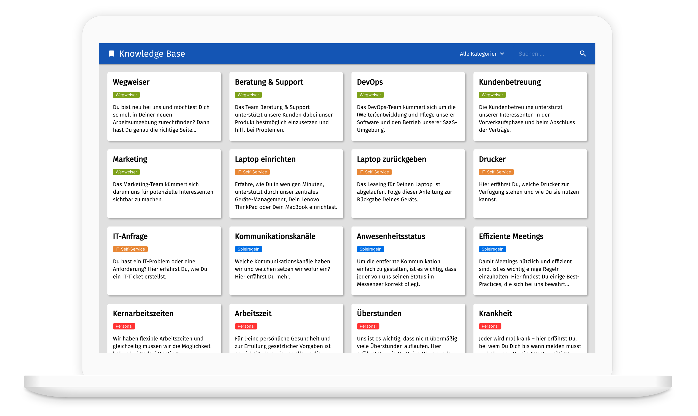

# Coding Challenge: Knowledge Base Frontend

Ziel der Aufgabe ist es, ein Frontend mit Filtermöglichkeiten zur Anzeige von Artikeln aus einer fiktiven Knowledge Base zu entwickeln.

## Prototypen
Zur Veranschaulichung der Funktionalität und zur Vorgabe des Designs existieren zwei Design-Prototypen:

- [Desktop-Prototype](https://framer.com/share/Coding-Frontend-Developer--lquySMVN3OZtTslz7B1g/VfUK15NXl)
- [Mobile-Prototype](https://framer.com/share/Coding-Frontend-Developer--lquySMVN3OZtTslz7B1g/cQkg7Br8G#cQkg7Br8G)

Beachte, dass die Prototypen nur der Veranschaulichung dienen und keine Produktionsreife Umsetzung darstellen.

## Backend
Das Backend ist über eine REST-API erreichbar:

- [Dokumentation der Backend-REST-API](https://documenter.getpostman.com/view/258409/TVzNGeMo#0b87bbc4-5d82-4deb-a3a3-c693dfaaa220)

## Fachliche Anforderungen
Im Folgenden werden die fachlichen Anforderungen beschrieben, die Deine Implementierung erfüllen soll.

### Allgemeine Anforderung
1. Aufbau und Design der App entsprechen dem Prototyp. Das Design von Filter-Dropdown und Suchfeld darf im Detail abweichen.
2. Die Darstellung ist responsiv

### Darstellung
1. Artikel aus der Knowledge Base werden als Karten in der Benutzeroberfläche dargestellt.
2. Jede Karte enthält folgende Informationen des Artikels:
	1. Titel
	2. Kategorie in der Kategoriefarbe
	3. Teaser-Text
3. Die Karten sind in Zeilen angeordnet. Die Anzahl der pro Zeile dargestellten Karten hängt von der Breite des Browsers ab. Auf einem Smartphone wird nur eine Karte pro Zeile dargestellt.
4. Passen nicht alle Karten auf den Bildschirm kann ich vertikal scrollen.
5. Die Darstellung berücksichtigt variable Textlängen.

### Ladeverhalten
1. Findet ein Ladevorgang statt, so wird ein Skeleton wie im Prototyp dargestellt.

### Filtern
1. Ich kann die Artikelliste nach Kategorie und/oder Suchbegriff eingrenzen.
	1. Wird nur die Kategorie angegeben, werden alle Artikel der Kategorie angezeigt
	2. Wird nur ein Suchbegriff angegeben, werden alle Artikel angezeigt, die den Suchbegriff im Titel oder Teaser-Text enthalten angezeigt
	3. Werden Kategorie _und_ Suchbegriff angegeben, werden alle Artikel angezeigt, die der Kategorie zugeordnet sind _und_ den Suchbegriff enthalten
2. Filterung nach Kategorie durch
	1. Auswahl einer Kategorie aus der Auswahlliste in der Titelleiste
	2. Klick auf die Kategorie auf einer Artikelkarte
3. Filterung nach Suchbegriff 
	1. Eingabe des Suchbegriffs im Suchfeld
	2. Es wird bereits während der Eingabe gefiltert
4. Existieren keine Artikel die den Filterkriterien entsprechen wird ein Platzhalterinhalt wie im Prototyp dargestellt
5. Um eine echte Anwendung nachzuahmen, führt jede Anpassung der Filterkriterien zu einem Laden der Artikel vom Backend

## Technische Anforderungen
1. Implementiere die Anwendung in TypeScript mit React
2. Schreibe _Unit_-Tests um die Funktionsfähigkeit des Filterverhaltens über die betroffenen Komponenten hinweg sicherzustellen
